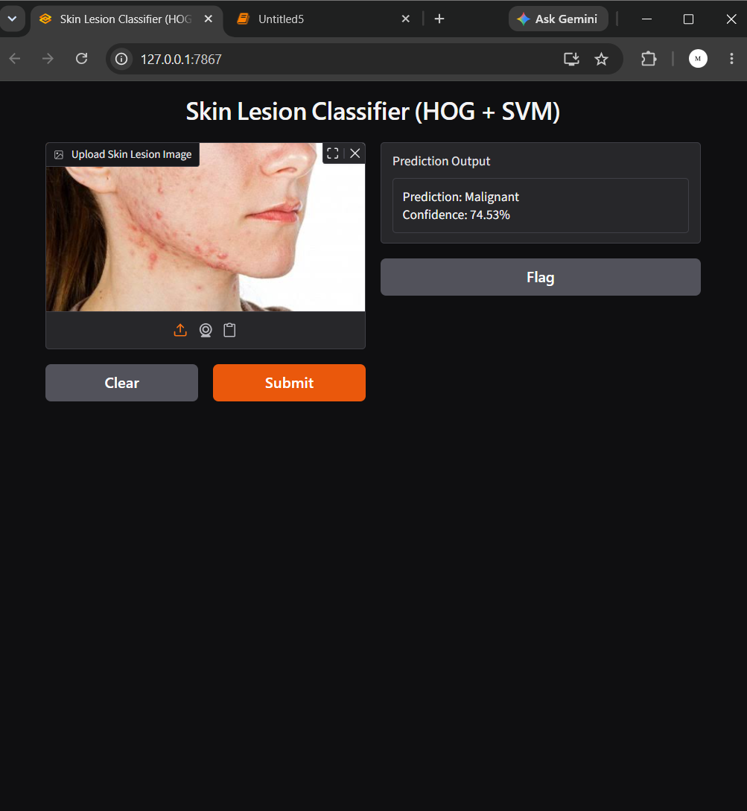

# Skin Lesion Classifier (HOG + SVM)

A collaborative project by **Monika G** and **Lakshaya S** that classifies skin lesion images as **benign** or **malignant** using a Histogram of Oriented Gradients (HOG) + Support Vector Machine (SVM) pipeline.

## Overview

We built this as a hands-on machine learning project to classify dermoscopic skin lesion images, trained on the ISIC Skin Cancer dataset.

## Workflow

1. **Dataset** — Downloaded the ISIC skin lesion dataset (benign/malignant, train/test split) via `kagglehub`
2. **Preprocessing** — Resized all images to 128×128 and converted to grayscale
3. **Feature Extraction** — Extracted HOG features (edges, shapes, local intensity patterns) from each image
4. **Training** — Scaled features with `StandardScaler` and trained an SVM classifier (RBF kernel)
5. **Evaluation** — Measured performance using accuracy, precision, recall, F1-score, ROC-AUC, and a confusion matrix

## Results

| Metric | Score |
|---|---|
| Accuracy | **78.3%** |
| Precision | 77.9% |
| Recall | 73% |
| F1-score | 0.754 |
| ROC-AUC | 0.870 |

## Demo

We also built a simple Gradio interface so users can upload a skin lesion image and get an instant prediction with confidence score.



## Tech Stack

- Python
- OpenCV
- scikit-image (HOG)
- scikit-learn (SVM)
- Gradio

## Running it yourself

```bash
pip install -r requirements.txt
```

Then open `skin-lesion-svm-classifier.ipynb` and run all cells top to bottom.

## Disclaimer

This is an **educational/portfolio project only** — not a diagnostic tool, and not a substitute for a dermatologist.
